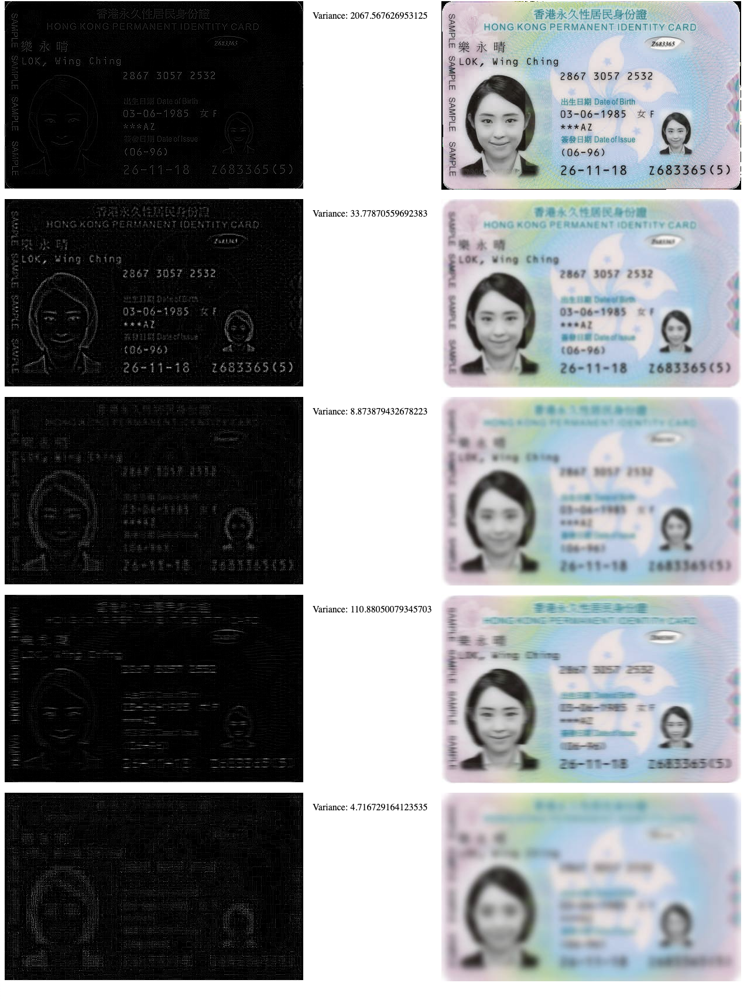

# HKID Edge Detection

A demo on HKID card sharpness detection with basic spatial filtering and compute the variances of the convoluted images. Computations conducted by TensorFlow.js.

See:
- https://homepages.inf.ed.ac.uk/rbf/HIPR2/log.htm
- https://stackoverflow.com/questions/6646371/detect-which-image-is-sharper

## Installation

A minimal web server is needed to [allow cross-origin use of images](https://developer.mozilla.org/en-US/docs/Web/HTML/CORS_enabled_image)

```
npx serve
```

## Result

Left: After applying the filter; Right: Before

